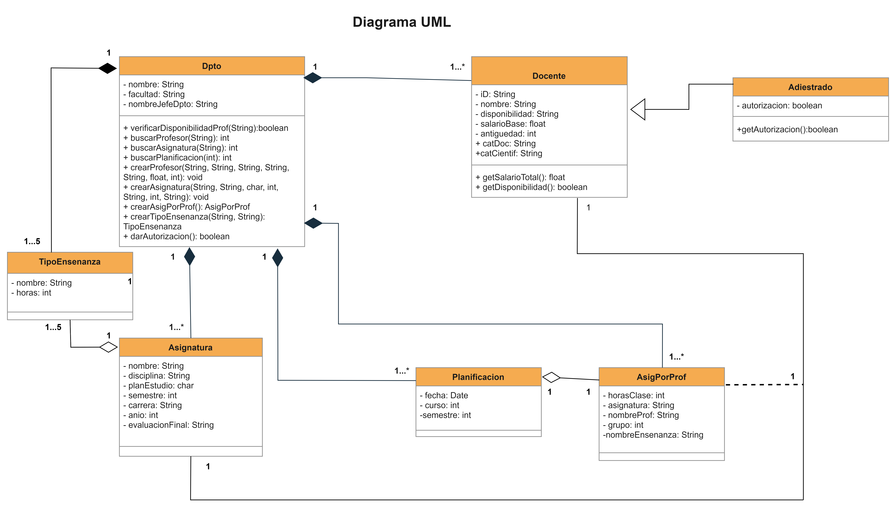

## Proyecto Final de OOP con interfaz gráfica desarrollada con JavaSwing

Desarrollado originalmente en colaboración con [Patty-03](https://github.com/Patty-03) utilizando Eclipse IDE y jdk 1.8. Esta nueva versión tiene el objetivo de hacer mis propios cambios sin afectar el resultado final del proyecto original presentado en el curso, y hacer mejoras por mi cuenta.

### - Enunciado del proyecto:
Como parte del Proyecto CUJAE se desea automatizar la planificación de la carga docente de un departamento, o sea, la asignación de profesores a las distintas asignaturas que se deben impartir en un semestre.
 

Del departamento a planificar se conoce el nombre, la facultad a la que pertenece, el nombre del jefe del departamento, los profesores de dicho departamento y la relación de las asignaturas que se gestionan en el mismo. De cada profesor del departamento se conoce el número de identidad, nombre y apellidos, categoría docente categoría científica (Doctor en Ciencias, Máster). La categoría docente de un profesor puede ser Titular, Auxiliar, Asistente, Instructor, Auxiliar Técnico de la Docencia o Adiestrado. El salario de un profesor se calcula a partir de su categoría docente, la antigüedad y el pago por la categoría científica. Todos parten de un salario base al que se le adiciona la antigüedad. Por último, se suma el importe correspondiente por la categoría docente y científica que ostente:

• Doctor: 500

• Máster: 300

• Titular: 500

• Auxiliar: 400

• Asistente: 300

• Instructor: 200

• Auxiliar Técnico de la Docencia: 100
 

De cada asignatura se conoce el nombre, la disciplina a la que pertenece, la cantidad de horas por cada tipo de enseñanza (conferencia, clase práctica, seminario, laboratorio, taller), el plan de estudios al que pertenece, la carrera y el año en que se imparte y si tiene o no evaluación final y en caso de tenerla, cuál (Examen Final o Trabajo de Curso).

 
Para la planificación se tendrá en cuenta la disponibilidad de los profesores en el periodo, es decir, solo se asignarán aquellos que no estén de licencia, en becas o liberados para determinadas responsabilidades. En el caso de los adiestrados en su primer año de trabajo, tienen que contar con la autorización de la universidad para impartir docencia y solo será posible si no existen profesores con categoría docente para asumir la carga docente a planificar. y las necesidades, es decir, la cantidad de grupos de conferencias y clases prácticas que existen en el momento de la planificación.

 
En el departamento se guarda un registro histórico con las planificaciones de cargas docentes de los semestres anteriores, que sirve como base inicial para cada nueva planificación.

En la planificación se debe tener en cuenta que las conferencias deben ser impartidas por profesores de categorías superiores y que en una semana un profesor no debe impartir más de 12 horas de clases.

